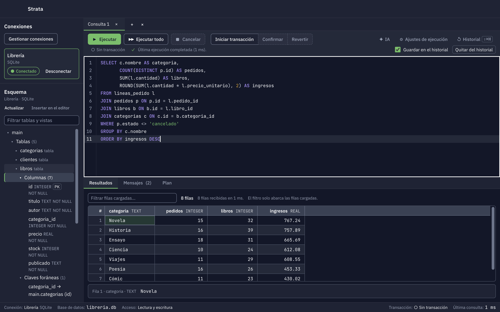
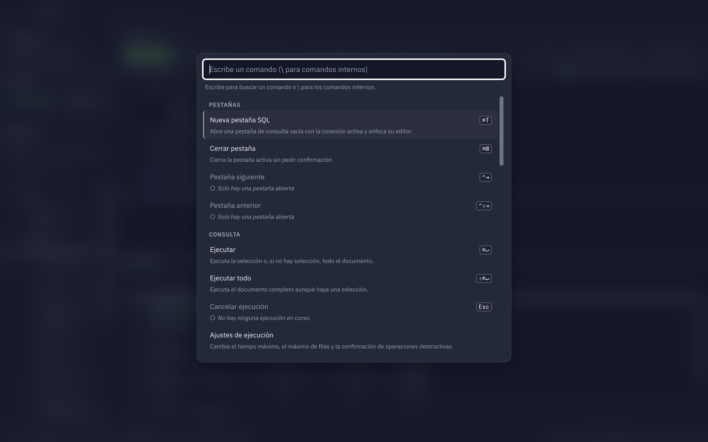
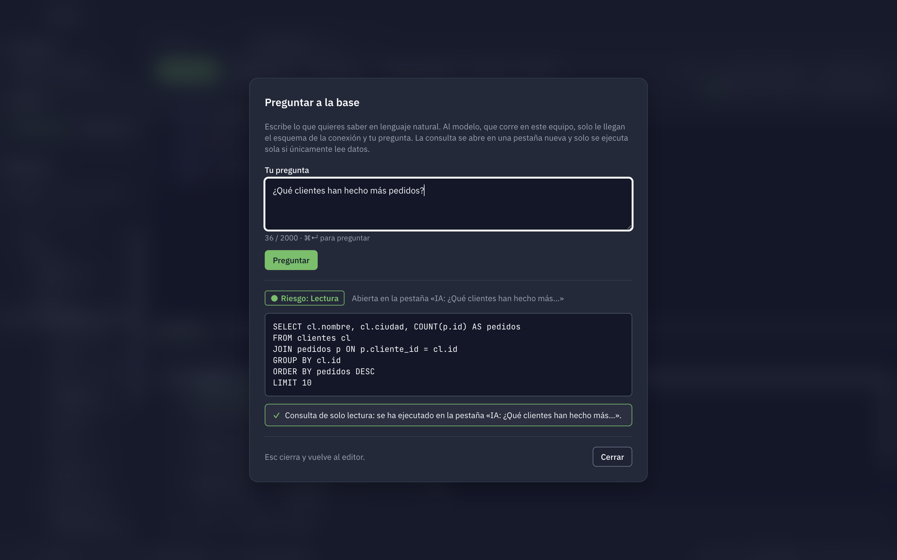
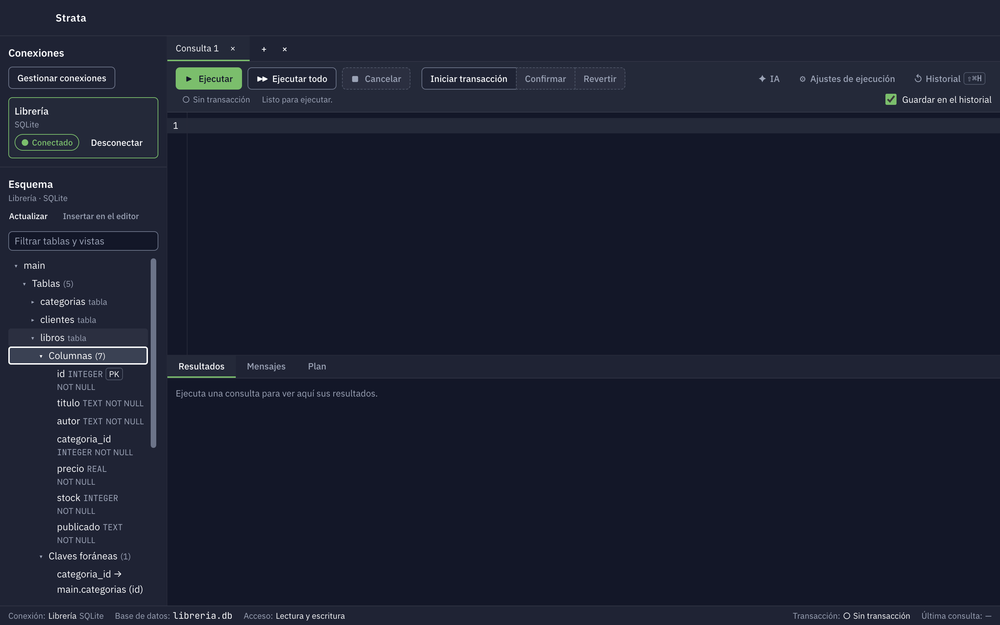
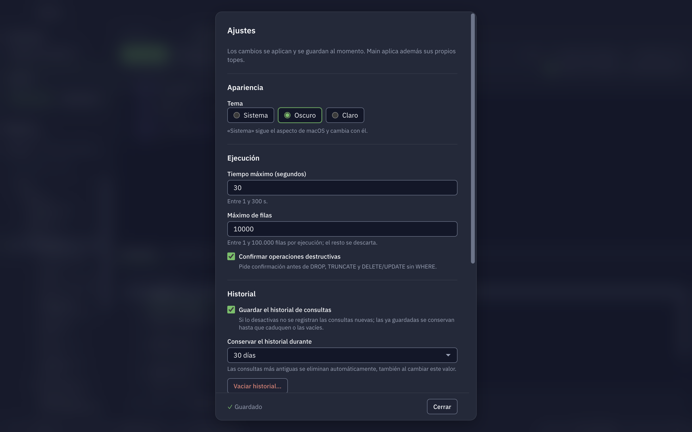

<div align="center">

# Strata

**Cliente de escritorio moderno para bases de datos, pensado para usarse con el teclado.**

Consola SQL, paleta de comandos y un asistente de IA que corre en tu propio equipo.

[](https://github.com/riigarXX/Strata/actions/workflows/ci.yml)


<br />

<picture>
  <source media="(prefers-color-scheme: dark)" srcset="docs/screenshots/editor-results-dark.png" />
  <source media="(prefers-color-scheme: light)" srcset="docs/screenshots/editor-results-light.png" />
  
</picture>

</div>

## ✨ Por qué Strata

- ⌨️ **Keyboard-first.** Cada operación principal tiene un comando y un atajo. La paleta (`⌘K`) encuentra cualquier cosa.
- 🔒 **Seguridad por diseño.** El renderer no tiene acceso a Node, drivers, sistema de archivos ni credenciales. Todo pasa por un contrato IPC tipado y validado.
- 🤖 **IA local y privada.** Pregunta en lenguaje natural y obtén SQL. El modelo corre en tu equipo (Ollama o LM Studio) y solo ve el esquema y tu pregunta, nunca tus filas.
- ⚡ **Resultados que escalan.** Streaming con backpressure y cuadrícula virtualizada: una consulta grande no congela la interfaz.
- 🎨 **Tema oscuro, claro y del sistema**, construido sobre design tokens con contraste WCAG comprobado por tests.

## 🖼️ Un vistazo

<table>
  <tr>
    <td width="50%">
      <picture>
        <source media="(prefers-color-scheme: dark)" srcset="docs/screenshots/command-palette-dark.png" />
        <source media="(prefers-color-scheme: light)" srcset="docs/screenshots/command-palette-light.png" />
        
      </picture>
      <p align="center"><b>Paleta de comandos</b><br />Todo a un atajo de distancia</p>
    </td>
    <td width="50%">
      <picture>
        <source media="(prefers-color-scheme: dark)" srcset="docs/screenshots/ask-ai-dark.png" />
        <source media="(prefers-color-scheme: light)" srcset="docs/screenshots/ask-ai-light.png" />
        
      </picture>
      <p align="center"><b>Preguntar a la base</b><br />De lenguaje natural a SQL, en local</p>
    </td>
  </tr>
  <tr>
    <td width="50%">
      <picture>
        <source media="(prefers-color-scheme: dark)" srcset="docs/screenshots/schema-browser-dark.png" />
        <source media="(prefers-color-scheme: light)" srcset="docs/screenshots/schema-browser-light.png" />
        
      </picture>
      <p align="center"><b>Explorador de esquema</b><br />Tablas, columnas, claves e índices</p>
    </td>
    <td width="50%">
      <picture>
        <source media="(prefers-color-scheme: dark)" srcset="docs/screenshots/settings-dark.png" />
        <source media="(prefers-color-scheme: light)" srcset="docs/screenshots/settings-light.png" />
        
      </picture>
      <p align="center"><b>Ajustes</b><br />Tema, límites de ejecución, historial e IA</p>
    </td>
  </tr>
</table>

## 🧰 Qué incluye

|                   |                                                                                                                                                                                                        |
| ----------------- | ------------------------------------------------------------------------------------------------------------------------------------------------------------------------------------------------------ |
| **Conexiones**    | Perfiles guardados con credenciales cifradas mediante `safeStorage` (Keychain de macOS).                                                                                                               |
| **Editor SQL**    | Pestañas, resaltado con CodeMirror 6, ejecución de la selección o del documento y cancelación.                                                                                                         |
| **Resultados**    | Cuadrícula virtualizada con filtro, detalle de celda y límites de filas configurables.                                                                                                                 |
| **Transacciones** | `begin` / `commit` / `rollback` explícitos, confirmación obligatoria en operaciones destructivas y bloqueo real en perfiles de solo lectura ([ADR 0004](docs/adr/0004-politica-sql-transacciones.md)). |
| **Historial**     | Local, con retención configurable y opt-out por consulta. Nunca guarda resultados ([ADR 0005](docs/adr/0005-retencion-historial.md)).                                                                  |
| **IA local**      | «Preguntar a la base» con Ollama o LM Studio. Solo se ejecuta sola una consulta de solo lectura; el resto se abre en una pestaña para que la revises ([ADR 0012](docs/adr/0012-ia-local.md)).          |
| **Motores**       | PostgreSQL 13+ y SQLite 3.35+ (este último en un `worker_thread`, así que cancelar y el timeout responden al instante).                                                                                |

## 🚀 Puesta en marcha

**Requisitos:** macOS en Apple Silicon, Node ≥ 22.12 (`.nvmrc`), pnpm 11 y las Xcode Command Line Tools. Docker es opcional y solo hace falta para los tests con PostgreSQL.

```bash
git clone https://github.com/riigarXX/Strata.git
cd Strata
pnpm install   # instala, descarga Electron y recompila better-sqlite3
pnpm dev       # arranca la app con recarga en caliente
```

| Comando                                              | Qué hace                                   |
| ---------------------------------------------------- | ------------------------------------------ |
| `pnpm test`                                          | Tests unitarios y de componentes           |
| `pnpm test:e2e`                                      | Tests E2E con Playwright sobre la app real |
| `pnpm typecheck` · `pnpm lint` · `pnpm format:check` | Comprobaciones de calidad                  |
| `pnpm dist`                                          | Genera el instalador `.dmg` y `.zip`       |
| `pnpm screenshots`                                   | Regenera las capturas de este README       |

Los detalles (tests de integración, particularidades del rebuild nativo, verificación con CDP) están en la [guía de desarrollo](docs/DEVELOPMENT.md).

## 🏗️ Arquitectura

```text
apps/desktop/      App Electron: main (drivers, sesiones, credenciales), preload y renderer Vue 3
packages/
  contracts/       Contrato IPC tipado y validado (Zod)
  db-core/         Adapters PostgreSQL y SQLite, análisis SQL y límites de resultados
  commands/        Registro de comandos, atajos y búsqueda difusa
  design-tokens/   Tokens de diseño y su generación
docs/              Guía de desarrollo, ADRs, modelo de amenazas y empaquetado
```

Una consulta viaja así: renderer → preload (`window.db`) → IPC validado en main → `QueryExecutor` → `DatabaseAdapter` → eventos por lotes de vuelta al renderer. Cada capa solo conoce a la de al lado.

## 📚 Documentación

- [Guía de desarrollo](docs/DEVELOPMENT.md): requisitos, scripts, tests, CI y cómo verificar de verdad.
- [Decisiones de arquitectura (ADRs)](docs/adr/)
- [Modelo de amenazas](docs/threat-model.md) y [auditoría de seguridad](docs/security-audit.md)
- [Empaquetado](docs/packaging.md)
- [Plan del producto](PLAN_BBDD_CLI.md)

## 📌 Estado

Strata está en desarrollo y de momento **solo soporta macOS** ([ADR 0002](docs/adr/0002-sistemas-operativos-objetivo.md)). El instalador aún no está firmado ni notarizado.
